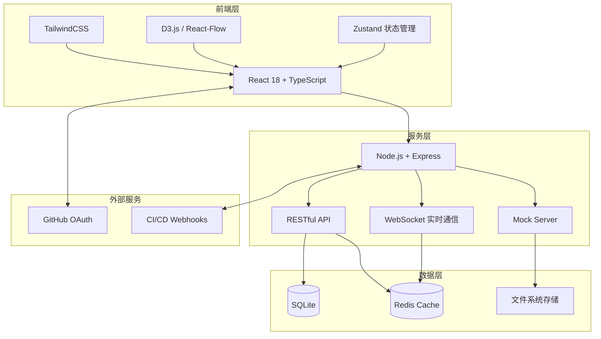
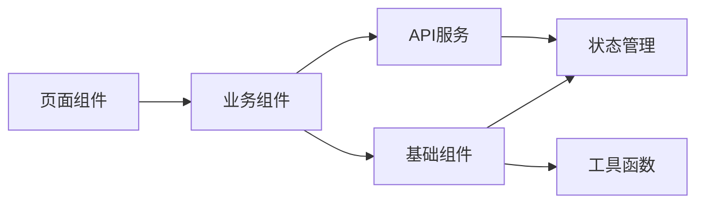
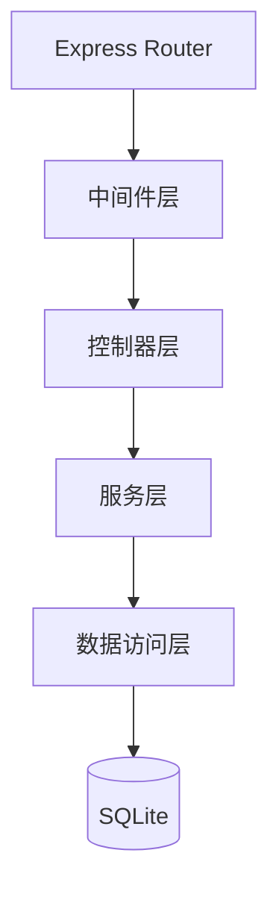
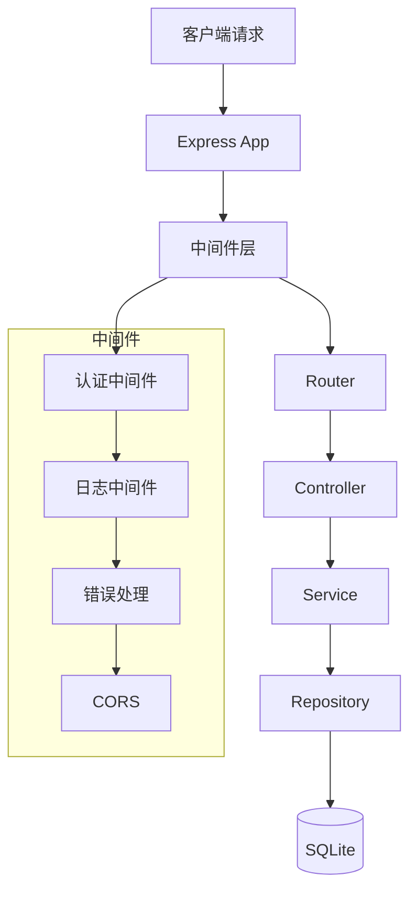
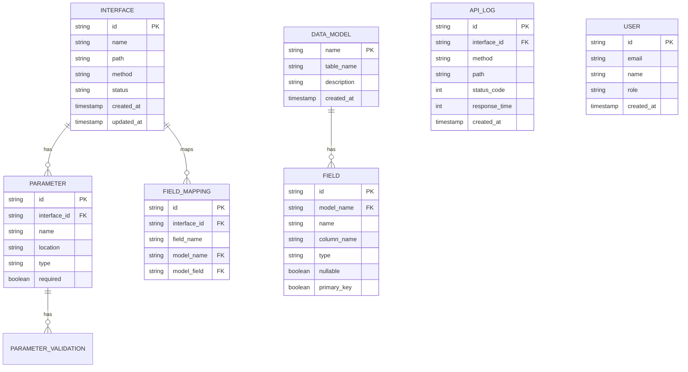
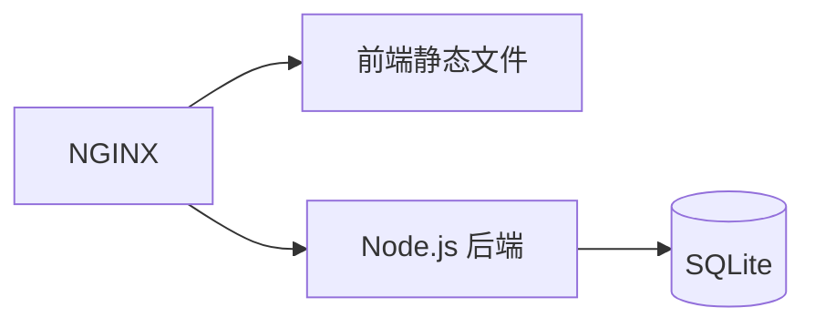

# Interface Hub - 技术架构文档

## 1. 架构设计

### 1.1 整体架构



### 1.2 前端架构



### 1.3 后端架构



## 2. 技术选型

### 2.1 前端技术栈

| 技术 | 版本 | 用途 |
|------|------|------|
| React | 18.2.0+ | UI 框架 |
| TypeScript | 5.0+ | 类型系统 |
| TailwindCSS | 3.4+ | CSS 框架 |
| Vite | 5.0+ | 构建工具 |
| D3.js | 7.8+ | 数据可视化 |
| React-Flow | 11.10+ | 流程图/关系图 |
| Zustand | 4.5+ | 状态管理 |
| React Router | 6.22+ | 路由管理 |
| Lucide React | 最新 | 图标库 |
| Recharts | 2.12+ | 图表库 |

### 2.2 后端技术栈

| 技术 | 版本 | 用途 |
|------|------|------|
| Node.js | 20.0+ | 运行时 |
| Express | 4.18+ | Web 框架 |
| SQLite | 3.44+ | 数据库 |
| better-sqlite3 | 9.4+ | SQLite 驱动 |
| Prisma | 5.10+ | ORM |
| JWT | 9.0+ | 认证 |
| ws | 8.16+ | WebSocket |
| CORS | 2.8+ | 跨域支持 |

### 2.3 开发工具

| 工具 | 用途 |
|------|------|
| ESLint | 代码规范 |
| Prettier | 代码格式化 |
| Husky | Git hooks |
| lint-staged | 提交前检查 |

## 3. 路由定义

### 3.1 前端路由

| 路由 | 页面 | 描述 |
|------|------|------|
| `/` | Dashboard | 可视化大屏首页 |
| `/interfaces` | InterfaceList | 接口列表页 |
| `/interfaces/:id` | InterfaceDetail | 接口详情页 |
| `/interfaces/new` | InterfaceCreate | 创建接口页 |
| `/interfaces/:id/edit` | InterfaceEdit | 编辑接口页 |
| `/models` | ModelList | 数据模型列表 |
| `/models/:name` | ModelDetail | 数据模型详情 |
| `/graph` | RelationGraph | 关系图谱页 |
| `/mock` | MockServer | Mock服务页 |
| `/testing` | ApiTester | 接口测试页 |
| `/settings` | Settings | 设置页面 |

### 3.2 后端 API

| 方法 | 路由 | 描述 |
|------|------|------|
| GET | `/api/interfaces` | 获取接口列表 |
| POST | `/api/interfaces` | 创建接口 |
| GET | `/api/interfaces/:id` | 获取接口详情 |
| PUT | `/api/interfaces/:id` | 更新接口 |
| DELETE | `/api/interfaces/:id` | 删除接口 |
| GET | `/api/models` | 获取数据模型列表 |
| POST | `/api/models` | 创建数据模型 |
| GET | `/api/models/:name` | 获取数据模型详情 |
| PUT | `/api/models/:name` | 更新数据模型 |
| DELETE | `/api/models/:name` | 删除数据模型 |
| GET | `/api/relations` | 获取关系图谱数据 |
| POST | `/api/mock/send` | 发送Mock请求 |
| POST | `/api/test/request` | 发送测试请求 |
| GET | `/api/logs` | 获取操作日志 |
| GET | `/api/stats` | 获取统计数据 |

## 4. API 定义

### 4.1 接口模型

```typescript
interface ApiInterface {
  id: string;
  name: string;
  path: string;
  method: 'GET' | 'POST' | 'PUT' | 'DELETE' | 'PATCH';
  description: string;
  category: string;
  tags: string[];
  requestParams: Parameter[];
  requestBody: RequestBody | null;
  responseBody: ResponseBody;
  status: 'draft' | 'published' | 'deprecated';
  version: string;
  createdBy: string;
  createdAt: string;
  updatedAt: string;
}

interface Parameter {
  name: string;
  in: 'query' | 'path' | 'header' | 'body';
  type: 'string' | 'number' | 'boolean' | 'object' | 'array';
  required: boolean;
  description: string;
  example?: any;
}

interface RequestBody {
  contentType: string;
  schema: object;
  example?: object;
}

interface ResponseBody {
  statusCode: number;
  contentType: string;
  schema: object;
  example?: object;
}
```

### 4.2 数据模型

```typescript
interface DataModel {
  name: string;
  tableName: string;
  description: string;
  fields: Field[];
  indexes: Index[];
  relations: Relation[];
  createdAt: string;
  updatedAt: string;
}

interface Field {
  name: string;
  columnName: string;
  type: string;
  nullable: boolean;
  primaryKey: boolean;
  defaultValue?: any;
  comment?: string;
}

interface Index {
  name: string;
  columns: string[];
  unique: boolean;
}

interface Relation {
  type: 'one-to-one' | 'one-to-many' | 'many-to-many';
  targetModel: string;
  foreignKey: string;
  targetKey: string;
}
```

### 4.3 关系图谱

```typescript
interface GraphNode {
  id: string;
  type: 'frontend' | 'interface' | 'backend' | 'database';
  label: string;
  data: ApiInterface | DataModel | FrontendPage | BackendService;
}

interface GraphEdge {
  id: string;
  source: string;
  target: string;
  type: 'calls' | 'maps_to' | 'depends_on';
  label?: string;
}

interface GraphData {
  nodes: GraphNode[];
  edges: GraphEdge[];
}
```

## 5. 服务器架构



### 5.1 中间件层

| 中间件 | 用途 |
|--------|------|
| 认证中间件 | JWT 验证 |
| 日志中间件 | 请求日志记录 |
| 错误处理 | 统一错误响应 |
| CORS | 跨域资源共享 |
| Body Parser | 请求体解析 |

### 5.2 控制器层

| 控制器 | 职责 |
|--------|------|
| InterfaceController | 接口 CRUD 操作 |
| ModelController | 数据模型 CRUD |
| RelationController | 关系图谱数据 |
| MockController | Mock 服务控制 |
| TestController | 测试请求处理 |
| StatsController | 统计数据 |

### 5.3 服务层

| 服务 | 职责 |
|------|------|
| InterfaceService | 接口业务逻辑 |
| ModelService | 模型业务逻辑 |
| GraphService | 图谱计算逻辑 |
| MockService | Mock 数据生成 |
| TestService | 测试执行逻辑 |
| AuthService | 认证授权逻辑 |

### 5.4 数据访问层

| 仓库 | 职责 |
|------|------|
| InterfaceRepository | 接口数据操作 |
| ModelRepository | 模型数据操作 |
| RelationRepository | 关系数据操作 |
| LogRepository | 日志数据操作 |

## 6. 数据模型

### 6.1 实体关系图



### 6.2 数据库表结构

```sql
-- 接口表
CREATE TABLE interfaces (
    id TEXT PRIMARY KEY,
    name TEXT NOT NULL,
    path TEXT NOT NULL,
    method TEXT NOT NULL,
    description TEXT,
    category TEXT,
    tags TEXT,
    status TEXT DEFAULT 'draft',
    version TEXT DEFAULT '1.0.0',
    request_schema TEXT,
    response_schema TEXT,
    created_by TEXT,
    created_at DATETIME DEFAULT CURRENT_TIMESTAMP,
    updated_at DATETIME DEFAULT CURRENT_TIMESTAMP
);

-- 参数表
CREATE TABLE parameters (
    id TEXT PRIMARY KEY,
    interface_id TEXT NOT NULL,
    name TEXT NOT NULL,
    location TEXT NOT NULL,
    type TEXT NOT NULL,
    required INTEGER DEFAULT 0,
    description TEXT,
    example TEXT,
    FOREIGN KEY (interface_id) REFERENCES interfaces(id) ON DELETE CASCADE
);

-- 数据模型表
CREATE TABLE data_models (
    name TEXT PRIMARY KEY,
    table_name TEXT NOT NULL,
    description TEXT,
    schema TEXT,
    created_at DATETIME DEFAULT CURRENT_TIMESTAMP,
    updated_at DATETIME DEFAULT CURRENT_TIMESTAMP
);

-- 字段表
CREATE TABLE fields (
    id TEXT PRIMARY KEY,
    model_name TEXT NOT NULL,
    name TEXT NOT NULL,
    column_name TEXT NOT NULL,
    type TEXT NOT NULL,
    nullable INTEGER DEFAULT 1,
    primary_key INTEGER DEFAULT 0,
    default_value TEXT,
    comment TEXT,
    FOREIGN KEY (model_name) REFERENCES data_models(name) ON DELETE CASCADE
);

-- 字段映射表
CREATE TABLE field_mappings (
    id TEXT PRIMARY KEY,
    interface_id TEXT NOT NULL,
    interface_field TEXT NOT NULL,
    model_name TEXT NOT NULL,
    model_field TEXT NOT NULL,
    created_at DATETIME DEFAULT CURRENT_TIMESTAMP,
    FOREIGN KEY (interface_id) REFERENCES interfaces(id) ON DELETE CASCADE,
    FOREIGN KEY (model_name) REFERENCES data_models(name) ON DELETE CASCADE
);

-- 操作日志表
CREATE TABLE api_logs (
    id TEXT PRIMARY KEY,
    interface_id TEXT,
    method TEXT,
    path TEXT,
    request_body TEXT,
    response_body TEXT,
    status_code INTEGER,
    response_time INTEGER,
    ip_address TEXT,
    user_agent TEXT,
    created_at DATETIME DEFAULT CURRENT_TIMESTAMP
);

-- 用户表
CREATE TABLE users (
    id TEXT PRIMARY KEY,
    email TEXT UNIQUE NOT NULL,
    name TEXT NOT NULL,
    password_hash TEXT,
    role TEXT DEFAULT 'developer',
    avatar TEXT,
    created_at DATETIME DEFAULT CURRENT_TIMESTAMP,
    updated_at DATETIME DEFAULT CURRENT_TIMESTAMP
);

-- 索引
CREATE INDEX idx_interfaces_status ON interfaces(status);
CREATE INDEX idx_interfaces_category ON interfaces(category);
CREATE INDEX idx_parameters_interface ON parameters(interface_id);
CREATE INDEX idx_fields_model ON fields(model_name);
CREATE INDEX idx_mappings_interface ON field_mappings(interface_id);
CREATE INDEX idx_logs_interface ON api_logs(interface_id);
CREATE INDEX idx_logs_created ON api_logs(created_at);
```

## 7. 项目目录结构

```
interface-hub/
├── client/                          # 前端应用
│   ├── public/
│   │   └── index.html
│   ├── src/
│   │   ├── assets/                  # 静态资源
│   │   │   └── styles/
│   │   │       └── index.css
│   │   ├── components/              # 组件
│   │   │   ├── common/              # 通用组件
│   │   │   │   ├── Button.tsx
│   │   │   │   ├── Card.tsx
│   │   │   │   ├── Modal.tsx
│   │   │   │   └── Table.tsx
│   │   │   ├── dashboard/            # 仪表盘组件
│   │   │   │   ├── StatCard.tsx
│   │   │   │   └── ActivityFeed.tsx
│   │   │   ├── interface/            # 接口管理组件
│   │   │   │   ├── InterfaceList.tsx
│   │   │   │   ├── InterfaceCard.tsx
│   │   │   │   ├── InterfaceForm.tsx
│   │   │   │   └── ParameterTable.tsx
│   │   │   ├── model/                # 数据模型组件
│   │   │   │   ├── ModelList.tsx
│   │   │   │   ├── ModelCard.tsx
│   │   │   │   └── FieldTree.tsx
│   │   │   ├── graph/                # 可视化组件
│   │   │   │   ├── RelationGraph.tsx
│   │   │   │   ├── NodeRenderer.tsx
│   │   │   │   └── EdgeRenderer.tsx
│   │   │   ├── mock/                 # Mock组件
│   │   │   │   ├── MockEditor.tsx
│   │   │   │   └── MockTester.tsx
│   │   │   └── test/                 # 测试组件
│   │   │       ├── RequestBuilder.tsx
│   │   │       └── ResponseViewer.tsx
│   │   ├── pages/                    # 页面
│   │   │   ├── Dashboard.tsx
│   │   │   ├── InterfaceList.tsx
│   │   │   ├── InterfaceDetail.tsx
│   │   │   ├── InterfaceCreate.tsx
│   │   │   ├── ModelList.tsx
│   │   │   ├── ModelDetail.tsx
│   │   │   ├── RelationGraph.tsx
│   │   │   ├── MockServer.tsx
│   │   │   ├── ApiTester.tsx
│   │   │   └── Settings.tsx
│   │   ├── hooks/                    # 自定义 Hooks
│   │   │   ├── useInterfaces.ts
│   │   │   ├── useModels.ts
│   │   │   ├── useGraph.ts
│   │   │   └── useApi.ts
│   │   ├── stores/                   # 状态管理
│   │   │   ├── interfaceStore.ts
│   │   │   ├── modelStore.ts
│   │   │   └── appStore.ts
│   │   ├── services/                 # API 服务
│   │   │   ├── api.ts
│   │   │   ├── interfaceService.ts
│   │   │   ├── modelService.ts
│   │   │   └── mockService.ts
│   │   ├── utils/                    # 工具函数
│   │   │   ├── helpers.ts
│   │   │   ├── validators.ts
│   │   │   └── formatters.ts
│   │   ├── types/                    # 类型定义
│   │   │   ├── interface.ts
│   │   │   ├── model.ts
│   │   │   └── graph.ts
│   │   ├── App.tsx
│   │   ├── main.tsx
│   │   └── vite-env.d.ts
│   ├── package.json
│   ├── tsconfig.json
│   ├── vite.config.ts
│   ├── tailwind.config.js
│   ├── postcss.config.js
│   └── .env.example
│
├── server/                          # 后端应用
│   ├── src/
│   │   ├── config/
│   │   │   └── database.ts
│   │   ├── controllers/
│   │   │   ├── interfaceController.ts
│   │   │   ├── modelController.ts
│   │   │   ├── relationController.ts
│   │   │   ├── mockController.ts
│   │   │   ├── testController.ts
│   │   │   └── statsController.ts
│   │   ├── services/
│   │   │   ├── interfaceService.ts
│   │   │   ├── modelService.ts
│   │   │   ├── graphService.ts
│   │   │   ├── mockService.ts
│   │   │   └── testService.ts
│   │   ├── repositories/
│   │   │   ├── interfaceRepository.ts
│   │   │   ├── modelRepository.ts
│   │   │   └── logRepository.ts
│   │   ├── middleware/
│   │   │   ├── auth.ts
│   │   │   ├── logger.ts
│   │   │   ├── errorHandler.ts
│   │   │   └── cors.ts
│   │   ├── routes/
│   │   │   ├── index.ts
│   │   │   ├── interfaceRoutes.ts
│   │   │   ├── modelRoutes.ts
│   │   │   ├── relationRoutes.ts
│   │   │   └── mockRoutes.ts
│   │   ├── utils/
│   │   │   ├── logger.ts
│   │   │   ├── validator.ts
│   │   │   └── generator.ts
│   │   ├── types/
│   │   │   └── index.ts
│   │   └── app.ts
│   ├── prisma/
│   │   └── schema.prisma
│   ├── package.json
│   ├── tsconfig.json
│   └── .env.example
│
├── .gitignore
├── .prettierrc
├── .eslintrc.json
├── package.json                     # 根目录 package.json
├── README.md
└── docs/
    ├── PRD.md
    └── ARCHITECTURE.md
```

## 8. 环境配置

### 8.1 开发环境变量

**前端 (.env)**
```
VITE_API_BASE_URL=http://localhost:3001/api
VITE_WS_URL=ws://localhost:3001
VITE_APP_NAME=Interface Hub
```

**后端 (.env)**
```
PORT=3001
DATABASE_URL=./data/interface-hub.db
JWT_SECRET=your-secret-key
JWT_EXPIRES_IN=7d
CORS_ORIGIN=http://localhost:5173
NODE_ENV=development
```

### 8.2 生产环境变量

```
PORT=3001
DATABASE_URL=${DATABASE_URL}
JWT_SECRET=${JWT_SECRET}
JWT_EXPIRES_IN=30d
CORS_ORIGIN=${PRODUCTION_URL}
NODE_ENV=production
```

## 9. 部署架构

### 9.1 单机部署



### 9.2 Docker 部署

```dockerfile
# Dockerfile
FROM node:20-alpine

WORKDIR /app

COPY package*.json ./
RUN npm ci --only=production

COPY . .

RUN npm run build

EXPOSE 3001

CMD ["npm", "start"]
```

## 10. 安全考虑

### 10.1 认证授权

- JWT Token 认证
- RBAC 角色权限控制
- API 密钥管理
- 操作审计日志

### 10.2 数据安全

- 参数化查询防 SQL 注入
- XSS 防护
- CSRF Token
- 敏感数据加密存储

### 10.3 接口安全

- 请求频率限制
- CORS 配置
- 输入验证
- 错误信息脱敏

## 11. 性能优化

### 11.1 前端优化

- 代码分割和懒加载
- 组件缓存
- 虚拟列表处理大数据
- 图片优化和 CDN

### 11.2 后端优化

- 数据库索引优化
- 查询缓存
- 连接池管理
- 异步处理

### 11.3 可视化优化

- Canvas/WebGL 渲染大图谱
- 节点分层加载
- 视口裁剪
- 缩放级别优化

## 12. 监控和日志

### 12.1 日志系统

- 请求日志
- 错误日志
- 操作审计日志
- 性能日志

### 12.2 监控指标

- 接口响应时间
- 错误率
- 活跃用户数
- 接口调用次数

## 13. 后续扩展

### 13.1 功能扩展

- GraphQL 支持
- WebSocket 实时更新
- API 版本管理
- OpenAPI 导入导出

### 13.2 集成扩展

- GitHub/GitLab 集成
- CI/CD 流水线集成
- API 网关集成
- 监控告警集成

### 13.3 性能扩展

- PostgreSQL 迁移
- Redis 缓存
- 分布式部署
- 负载均衡
