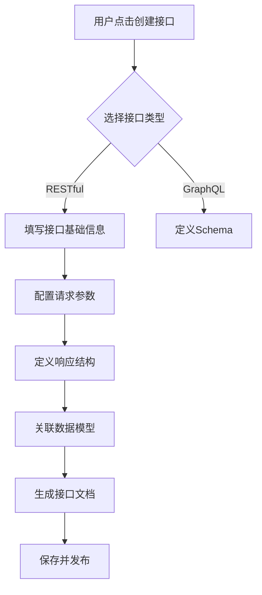
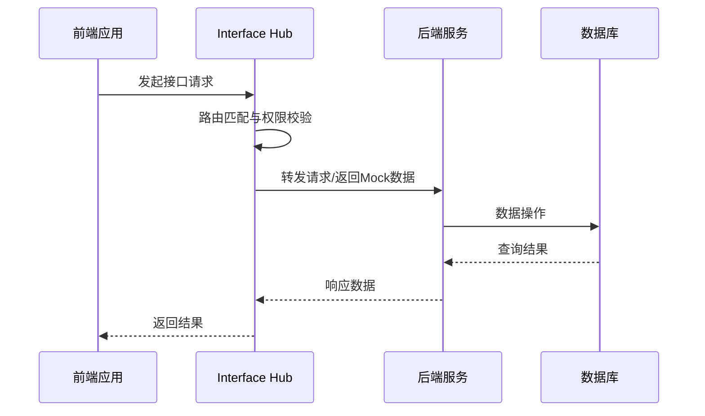

# Interface Hub - 接口管理工具产品需求文档

## 1. 产品概述

Interface Hub 是一款现代化的前后端接口关系可视化管理系统，旨在帮助开发团队更好地理解、管理和追踪前后端接口与数据库表之间的关系。该工具解决了以下核心问题：

- **问题一**：前后端协作时，接口定义不清晰、文档不一致
- **问题二**：接口与数据库表的映射关系难以追踪
- **问题三**：接口变更影响范围不明确，开发效率低下
- **问题四**：接口文档维护成本高，容易过时

**目标用户**：全栈开发团队、前后端分离的项目组、API开发者、技术项目经理

**市场价值**：
- 提升前后端协作效率，减少沟通成本
- 规范化接口管理，降低出错率
- 可视化数据流转，帮助新人快速理解系统架构

## 2. 核心功能

### 2.1 用户角色

| 角色 | 注册方式 | 核心权限 |
|------|---------|---------|
| 管理员 | 系统初始化 | 全功能访问、用户管理、系统配置 |
| 开发者 | 邮箱注册/SSO | 创建编辑接口、管理数据模型、查看所有内容 |
| 访客 | 无需登录 | 仅查看功能（只读模式）|

### 2.2 功能模块

1. **可视化大屏**：展示系统全貌，包含接口数量、调用统计、数据模型分布
2. **接口管理页面**：CRUD接口、版本管理、文档生成
3. **数据模型页面**：数据库表结构管理、字段类型定义
4. **关系图谱页面**：接口-字段-表的可视化关系展示
5. **Mock服务页面**：接口Mock配置、数据模拟
6. **测试工具页面**：在线接口测试、日志记录
7. **设置页面**：系统配置、权限管理、操作日志

### 2.3 页面详情

| 页面名称 | 模块名称 | 功能描述 |
|---------|---------|---------|
| 可视化大屏 | 统计卡片 | 展示接口总数、调用次数、数据模型数量 |
| 可视化大屏 | 关系图谱 | D3.js 力导向图，展示前端→接口→后端→数据库的完整链路 |
| 接口管理 | 接口列表 | 支持搜索、筛选、分页，展示接口基本信息 |
| 接口管理 | 接口详情 | 完整接口信息、请求参数、响应结构、字段映射 |
| 接口管理 | 接口编辑器 | 创建/编辑接口，参数定义，文档编写 |
| 数据模型 | 表列表 | 数据库表管理，支持表结构预览 |
| 数据模型 | 字段详情 | 字段类型、约束、索引、注释管理 |
| 数据模型 | 字段映射 | 接口字段与数据库字段的映射关系 |
| Mock服务 | Mock配置 | 自定义Mock数据，响应延迟、状态码设置 |
| 测试工具 | 请求构造 | HTTP方法、URL、参数、请求体设置 |
| 测试工具 | 响应预览 | 状态码、响应时间、响应体展示 |
| 设置页面 | 权限配置 | 用户角色、接口访问权限 |
| 设置页面 | 操作日志 | 用户操作记录，支持时间范围筛选 |

## 3. 核心流程

### 3.1 接口创建流程

### 3.2 接口调用流程

### 3.3 数据模型关联流程

## 4. 用户界面设计

### 4.1 设计风格

**设计理念**：科技感 + 专业性 + 可视化美学

**配色方案**：
- 主色：#2563EB（科技蓝）
- 辅助色：#10B981（成功绿）、#F59E0B（警告黄）、#EF4444（错误红）
- 背景色：#0F172A（深色）、#F8FAFC（浅色）
- 文字色：#1E293B（主文字）、#64748B（次要文字）
- 边框色：#E2E8F0（浅色边框）、#334155（深色边框）

**按钮样式**：
- 圆角按钮：rounded-lg，padding 0.75rem 1.5rem
- 悬停效果：transform scale(1.02)，box-shadow 增强
- 主按钮：实心背景，subtle 动画
- 次要按钮：边框样式，ghost 效果

**字体设置**：
- 主字体：'Inter', 'Noto Sans SC', sans-serif
- 代码字体：'JetBrains Mono', 'Fira Code', monospace
- 标题：bold，line-height 1.2
- 正文：regular，line-height 1.6

**布局风格**：
- 侧边栏导航：固定左侧，宽度 280px
- 内容区域：flex-1，最大宽度 1440px
- 卡片布局：grid 响应式网格，gap 1.5rem
- 顶部统计：数字动画 + 图表组合

**图标风格**：
- 使用 Lucide React 图标库
- 线条风格，统一 24px 尺寸
- 悬停时颜色变化

### 4.2 页面设计概览

#### 可视化大屏

**统计卡片模块**：
- 渐变背景卡片
- 数字使用 CountUp 动画
- 图标左侧，数值右侧对齐
- 悬停时轻微上浮效果

**关系图谱模块**：
- D3.js 力导向图
- 节点分类：前端（圆形）、接口（六边形）、后端（方形）、数据库（圆柱形）
- 连线支持拖拽动画
- 支持缩放和平移
- 点击节点展开详情面板

**近期活动模块**：
- 时间线布局
- 图标区分操作类型
- 显示操作用户和时间

#### 接口管理页面

**接口列表模块**：
- 表格式布局，固定表头
- 支持多选操作
- 行悬停高亮
- 快速操作按钮（编辑、删除、测试）
- 状态标签（开发中、已发布、已弃用）

**接口详情模块**：
- 选项卡布局：基本信息 / 请求参数 / 响应结构 / 字段映射 / 测试记录
- 代码块使用语法高亮
- JSON 格式化展示
- 复制功能按钮

**接口编辑器模块**：
- 分步表单：基础信息 → 请求参数 → 响应结构 → 高级配置
- 实时预览效果
- 自动保存草稿
- 参数校验提示

#### 数据模型页面

**表列表模块**：
- 卡片网格布局
- 显示表名、主键、外键数量
- 表关系简图
- 快速预览和编辑入口

**字段详情模块**：
- 树形结构展示
- 类型、约束、注释可视化
- 支持批量编辑
- 字段血缘分析

**字段映射模块**：
- 左右对照布局：接口字段 ←→ 数据库字段
- 连线可视化
- 支持拖拽调整映射
- 冲突检测和提示

#### Mock服务页面

**Mock配置模块**：
- 开关控制启用/禁用
- 自定义响应数据编辑器
- 响应延迟设置滑块
- 状态码选择器
- 动态数据生成规则

**Mock测试模块**：
- 请求历史列表
- 实时请求预览
- 响应对比展示

#### 测试工具页面

**请求构造模块**：
- HTTP 方法下拉选择
- URL 输入框带环境变量支持
- 参数表格编辑
- 请求体 JSON 编辑器
- 请求头管理

**响应预览模块**：
- 状态码大字体显示
- 响应时间统计图表
- 响应体格式化
- 请求耗时分析

### 4.3 响应式设计

**桌面优先，移动适配**：
- Desktop (≥1280px)：完整侧边栏 + 多列布局
- Tablet (768px-1279px)：可折叠侧边栏 + 双列布局
- Mobile (<768px)：底部导航 + 单列布局
- 触控优化：大按钮、宽点击区域

### 4.4 可视化 3D 元素指导

**关系图谱 3D 模式**（可选功能）：
- 使用 Three.js 实现
- 节点使用几何体 + 发光材质
- 支持旋转查看
- 深度效果增强立体感

## 5. 扩展应用场景

### 5.1 接口变更追踪

**功能描述**：记录接口历史版本，展示变更内容，追踪影响范围

**核心特性**：
- 版本历史时间线
- 变更差异对比（diff 视图）
- 影响分析：哪些前端页面受影响
- 变更通知和订阅
- 回滚到历史版本

**使用场景**：
- 接口结构调整时
- 参数类型变更时
- 响应结构变化时

### 5.2 接口文档管理

**功能描述**：自动生成接口文档，支持在线预览和导出，实时同步前后端接口定义

**核心特性**：
- Markdown 文档编写
- 文档模板自动填充
- 支持导出 PDF/HTML/Markdown
- 文档版本控制
- 在线评论和讨论

**使用场景**：
- API 文档生成
- 技术方案编写
- 对外接口文档

### 5.3 Mock 数据支持

**功能描述**：提供 Mock 服务器功能，支持自定义 Mock 数据，模拟接口响应

**核心特性**：
- 本地 Mock 服务器
- 动态数据生成（姓名、邮箱、UUID等）
- 响应延迟模拟
- 异常场景模拟（超时、错误码）
- 场景切换（开发/测试/生产）

**使用场景**：
- 前端独立开发
- 接口测试
- 异常情况处理

### 5.4 接口测试

**功能描述**：内置接口测试工具，支持参数校验，历史测试记录

**核心特性**：
- 快速发送请求
- 参数化测试
- 测试用例管理
- 测试报告生成
- CI/CD 集成

**使用场景**：
- 接口调试
- 回归测试
- 性能测试

### 5.5 权限和协作

**功能描述**：团队协作支持，接口访问权限控制，操作日志记录

**核心特性**：
- 团队项目管理
- 成员角色权限
- 操作审计日志
- 实时协作编辑
- 变更通知

**使用场景**：
- 多人协作开发
- 权限管理
- 审计追踪

## 6. 非功能需求

### 6.1 性能需求

- 页面加载时间 < 3秒
- 接口响应时间 < 200ms
- 支持 1000+ 接口数据展示流畅
- 图谱渲染支持 500+ 节点

### 6.2 安全需求

- JWT 认证
- 接口访问权限控制
- 操作日志审计
- 数据加密传输

### 6.3 兼容性

- 现代浏览器（Chrome、Firefox、Safari、Edge）
- 移动端浏览器
- 支持黑暗模式

### 6.4 可用性

- 操作步骤 ≤ 3 步完成常用功能
- 清晰的错误提示
- 操作反馈即时
- 键盘快捷键支持

## 7. 项目约束

- 开发周期：MVP 版本 2-3 周
- 技术栈优先选择成熟方案
- 支持后续扩展和定制
- 保持代码质量和可维护性
